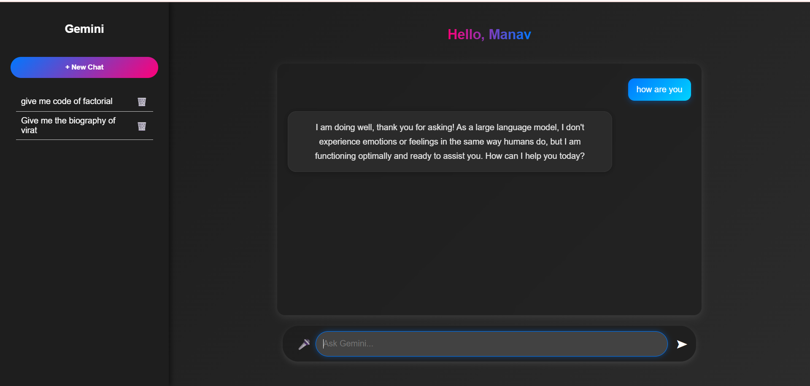
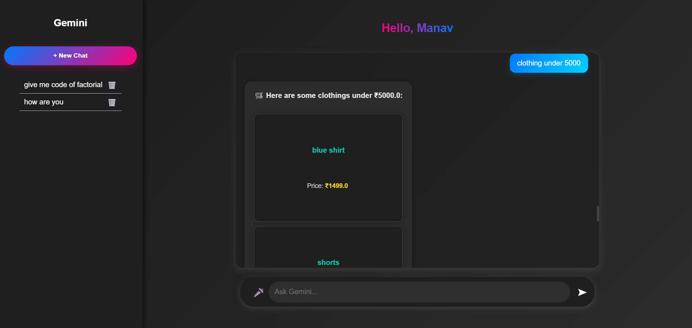

# Spring AI — Gemini-like Conversational AI with E-commerce Search

This project is a **Gemini AI clone**: a conversational AI assistant built with **Spring Boot**, **HTML**, **CSS**, and **JavaScript**.  
It can respond to general questions *like ChatGPT* and also perform **dynamic product searches** if the query matches your **e-commerce database**.

---

## ✨ Features

- 💬 GPT-like general chat.
- 🛒 Smart e-commerce product search (e.g. “clothing under 5000”).
- Multiple chats with sidebar history.
- Clean dark theme with modern UI.
- Delete chat option.

---

## ⚙️ Tech Stack

- **Backend:** Java, Spring Boot, JDBC/JPA
- **Frontend:** HTML, CSS, JavaScript
- **Database:** MySQL (or your choice)

---

## 🚀 Installation & Run

1️⃣ **Clone the repo**

```bash
git clone https://github.com/Manavdave1512/Spring-AI.git
cd Spring-AI


2️⃣ Configure your database

src/main/resources/application.properties and update with your DB details:

spring.datasource.url=jdbc:mysql://localhost:3306/your_db_name
spring.datasource.username=your_db_username
spring.datasource.password=your_db_password

3️⃣ Run the backend

Make sure you have Java and Maven installed:
./mvnw spring-boot:run

4️⃣ Run the frontend

Open index.html in your browser or serve it using a local HTTP server.

## 📸 Screenshots

### 🗨️ General Chat



### 🛍️ E-commerce Product Search

